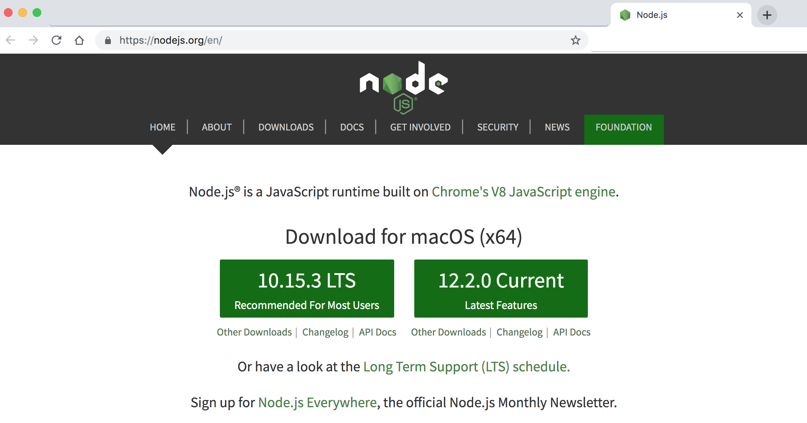
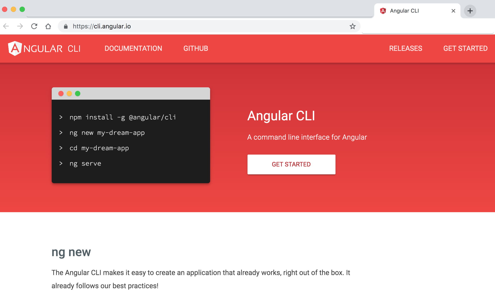

    

Topics include
===================== 

1. [Getting Started](#01-getting-started)
2. [Angular First Hello World App](#02-angular-first-hello-world-app)

01 Getting Started
=====================
1.1. Pre-requisites:
---------------------
Basic familiarity with HTML, CSS and JavaScript is must.

- HTML          - Markup
- CSS           - Style, Formates
- JavaScript    - Behaviour, Click, Validations
- TypeScript basics - Advanced JS features (Class, Arrow Function, Spread Operator)
- Text Editor / Visual Text Editors

1.2. Setup the Angular development environment:    
---------------------
In this section, we will learn how to set up a local development environment to start developing Angular apps. 

- `Node`, (website: https://nodejs.org/en) 
- `NPM`, (Node Package Manager - comes inbuilt with Node)
- `Angular CLI = Command Line Interface`, Angular CLI (Command Line Interface) for angular (website:  https://cli.angular.io/), 
    - it allows the developer to build/generate building blocks of angular application like component, services, routings, modules, etc. with best practices quicker and easier)
- `Text Editor`
    - Visual Studio Code / Visual Studio Code Insiders (website: https://code.visualstudio.com)
    - Sublime Text, 
    - Atom, 
    - Brackets etc.

1.3. Steps to Setup the Angular development environment:
---------------------
1. Download and Install node (node comes with npm) (website: https://nodejs.org/en)

  <figure>
    &nbsp;&nbsp;&nbsp; 
    <figcaption>&nbsp;&nbsp;&nbsp; Image - Nodejs website - https://nodejs.org/en</figcaption>
  </figure>

2. After installation check version of node and npm by command: `node -v` / `node --version` OR `npm -v` / `npm --version`
3. Install Angular CLI (website https://cli.angular.io/) by using command: `npm install -g @angular/cli` (it will install Angular CLI globally)

  <figure>
    &nbsp;&nbsp;&nbsp; 
    <figcaption>&nbsp;&nbsp;&nbsp; Image - Angular CLI website - https://cli.angular.io/</figcaption>
  </figure>

4. After installation check version of angular CLI by using the command: `ng -v` OR `ng --version`, you can also verify angular CLI installation by command: `ng` OR `ng --help`
5. Create a new app with angular CLI by using syntax: `ng new project/appName` example: command: `ng new angular6-1-demo`
6. Go inside the project/app directory, command: `cd angular6-1-demo`
7. Build and run Angular App, command: `ng serve` OR `ng serve -o` OR `ng serve --open`
8. Go to the browser and launch/check Angular App by entering the web address: `localhost:4200`

1.4. Commonly / widely used node/npm commands:
---------------------
- to get Node version, type command: `node -v`  OR `node --version`
- to get NPM version, type command: `npm -v`  OR `npm --version`
- to install Angular CLI, type command: `npm install -g @angular/cli`
- to get angular CLI version, type command: `ng -v` OR `ng --version` (this command displays details of a node, npm, and other angular package versions)
- to get various angular CLI commands, type command: `ng` OR `ng --help` 

02 Angular First Hello World App
=====================
2.1. Creating new Angular App
---------------------
- If using Visual Studio Code / Insiders, open Command panel/terminal from menu: View -> Terminal (shortcut key is `CTRL + BackTick` OR `COMMAND + J`)
- To create a new app with angular CLI by using syntax: `ng new project/appName` example: command: `ng new angular6-1-demo`
- Go inside the project/app directory, command: `cd angular6-1-demo OR cd appName`
- To Build and run Angular App, command: `ng serve / npm start` OR `ng serve -o` OR `ng serve --open`
- To change port from 4200 to other port - type command:  `ng serve --port 5000`
- To check the application in browser type path/url: `localhost:4200 / 5000`

2.2. Working with existing/cloned/copied Angular App
---------------------
- Clone or Download the project/app from Github or any other sources
- If using Visual Studio Code / Insiders, open Command panel/terminal from menu: View -> Terminal (shortcut key is `CTRL + BackTick` OR `COMMAND + J`)
- Go inside the project/app directory, command: `cd _examples-angular6-1-demo OR cd appName`
- Run command: `npm install` to install project/app dependencies `(node_modules)`
- To Build and run Angular App, command: `ng serve / npm start` OR `ng serve -o` OR `ng serve --open`
- To change port from 4200 to other port - type command:  `ng serve --port 5000`
- To check the application in browser type path/url: `localhost:4200 / 5000`